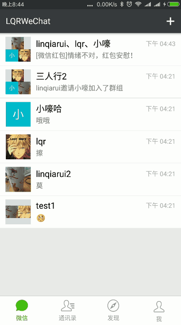
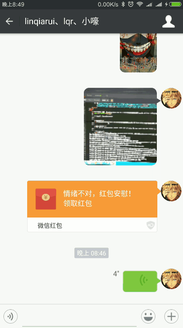
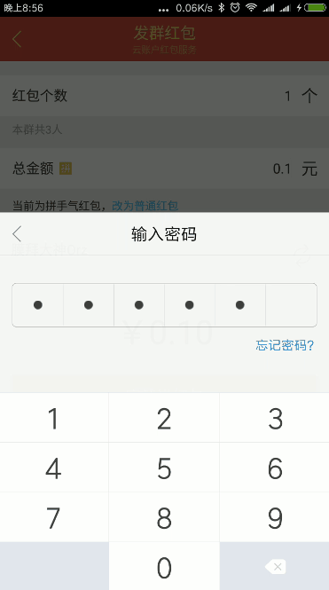
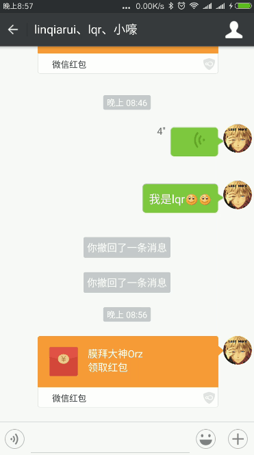
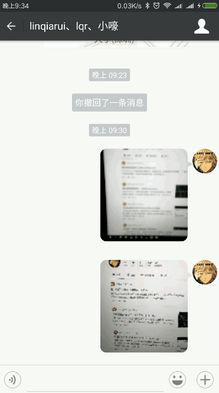
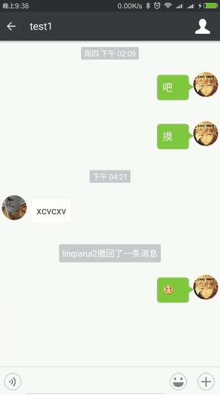
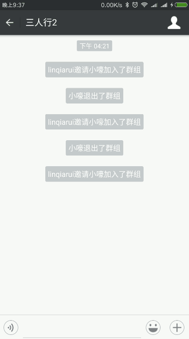
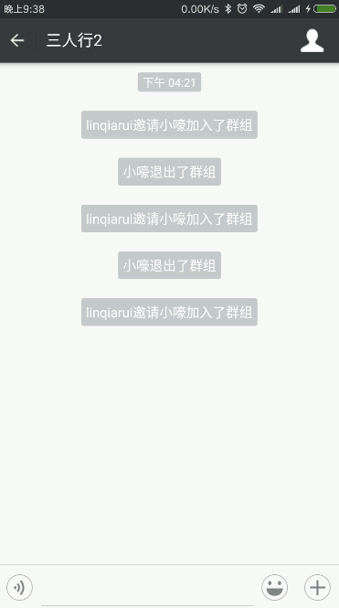
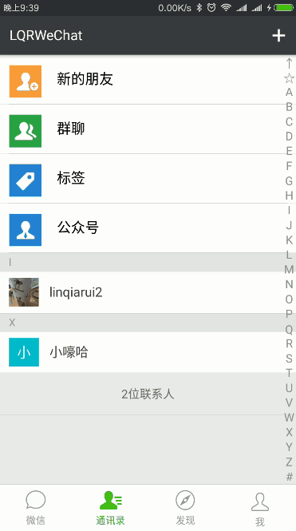

高仿微信6.5.7（融云版）
============

## 目录
* [一、简述](#一简述)
* [二、功能](#二功能)
* [三、效果图](#三效果图)

# 一、简述

## 1、简单介绍一下：
这个项目是高仿微信项目，仿最新版微信6.5.7（除图片选择器外）。本项目基于融云SDK，使用目前较火的 Rxjava+Retrofit+MVP+Glide 技术开发。相比上个版本，加入发送位置消息，红包消息等功能。欢迎start和fork~~

## 2、制作该开源项目的原因有：

1. 熟练使用 Rxjava+Retrofit+MVP+lambda 等新安卓技术。
2. 熟悉融云等SDK的使用。
3. 向高手进阶过渡。

# 二、功能

## 1、好友

1. 查询好友
1. 发起添加好友请求
1. 查看好友个人信息
1. 设置备注
1. 删除好友
1. 扫码加好友
1. 查看新加朋友

## 2、群组

1. 拉人进群
1. 踢人去群
1. 修改群昵称
1. 查看群二级码
1. 扫码加入群组
1. 解散群（群主）
1. 退出群（群成员）

## 3、个人

1. 查看头像
1. 上传更新头像
1. 修改个人昵称
1. 查看个人二维码

## 4、会话

1. 会话置顶
1. 取消置顶
1. 删除会话
1. 撤回消息
1. 发送文本消息
1. 发送图片消息
1. 发送视频消息
1. 发送语音消息
1. 发送贴图消息
1. 发送位置消息
1. 发送红包消息

## 5、系统

1. 登录
1. 注册
1. 退出当前账号
1. 退出APP

## 6、尚未完成

1. 消息通知
1. @功能
1. 对方输入状态提示

# 三、效果图

# 四、其他相关

## 1、该项目使用到的技术有：

1. Rxjava 2.0
1. Retrofit 2.0
1. MVP 
1. Glide
1. lambda
1. ...

## 2、用到的主要库有：

### 主要的大神库：

1. [鸿神的AutoLayout](https://github.com/hongyangAndroid/AndroidAutoLayout)
1. [郭神的LitePal](https://github.com/LitePalFramework/LitePal)
1. [bingoogolapple的万能刷新控件](https://github.com/bingoogolapple/BGARefreshLayout-Android)
1. [bingoogolapple的二维码控件扫描库](https://github.com/bingoogolapple/BGAQRCode-Android)
1. [CJT2325的仿微信拍照Android控件](https://github.com/CJT2325/CameraView)

1. [万能适配器](https://github.com/GitLqr/LQRAdapterLibrary)
1. [包装过的RecyclerView](https://github.com/GitLqr/LQRRecyclerViewLibrary)
1. [高仿微信表情库](https://github.com/GitLqr/LQREmojiLibrary)
1. [高仿微信主意库](https://github.com/GitLqr/LQRAudioRecord)
1. [高仿微信图片选择器](https://github.com/GitLqr/LQRImagePicker)
1. [高仿微信九宫格控件](https://github.com/GitLqr/LQRNineGridImageView)
1. [常用选项条目库](https://github.com/GitLqr/LQROptionItemView)
